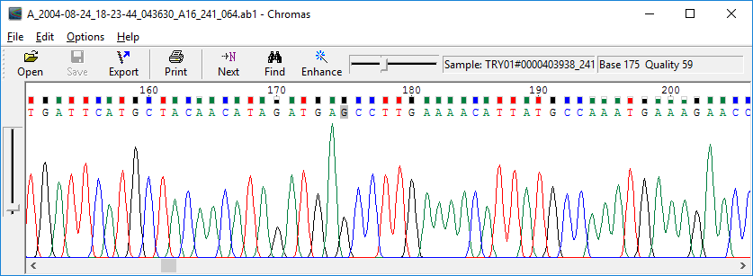
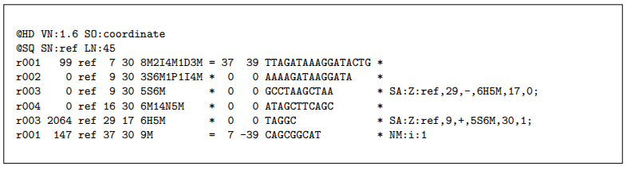
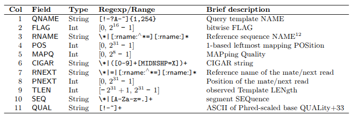
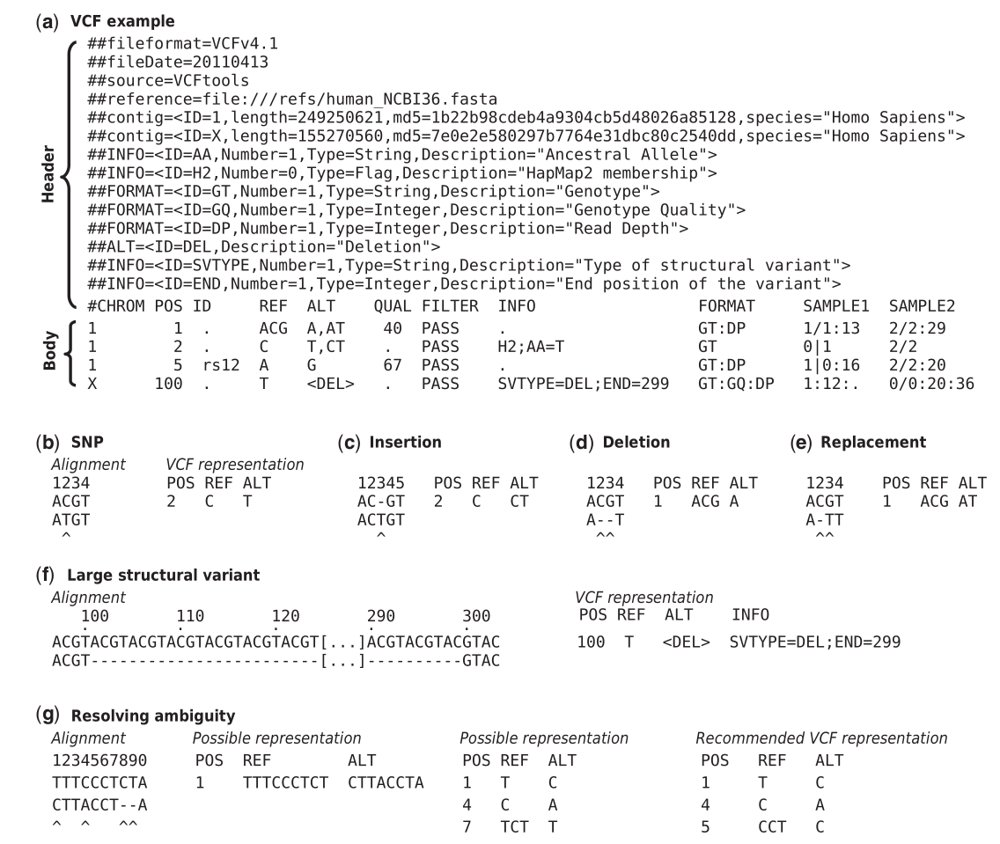
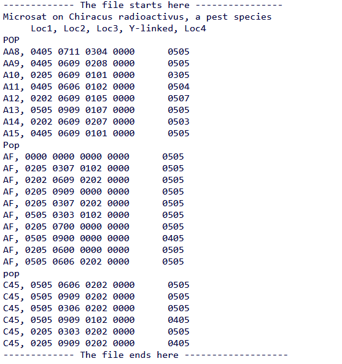
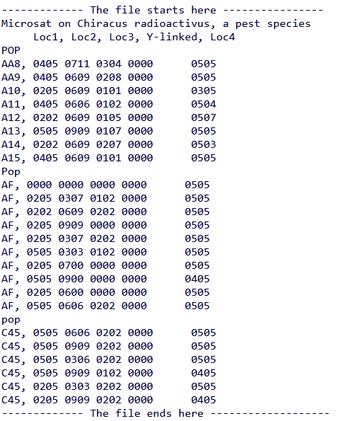

# 1.3 Formatos de datos en Bioinformática para la Biología Evolutiva

Actualmente, en biología evolutiva se emplea una gran variedad de formatos para el análisis de datos. En algunos casos, programas o paquetes nuevos requieren formatos ad hoc que contengan la información necesaria para cumplir con los supuestos de cada análisis. Lo más común es partir de un formato base o primario, como los generados por plataformas de secuenciación, entre los que destacan AB1, FASTQ o BAM.


## 1.3.1 Formato AB1 (cromatograma)

Debido a su precisión, la secuenciación Sanger se considera el estándar de referencia. Los datos de salida se reportan en forma de cromatograma, que permite visualizar los picos de secuenciación. Estos cromatogramas se almacenan en archivos de texto con extensión .ab1.

A pesar de su alta precisión, la secuenciación Sanger tiene limitaciones en cuanto a la rapidez, costo, cantidad y longitud de los fragmentos producidos, por lo que suele emplearse para secuenciar fragmentos menores a 1000 pb. [1](https://www.cd-genomics.com/blog/sanger-sequencing-introduction-principle-and-protocol/)

**Visualización y análisis de archivos AB1**

El formato .ab1 puede visualizarse en diferentes [programas](https://fileinfo.com/extension/ab1), como [Chromas](http://technelysium.com.au/wp/chromas/) o Geneious. La revisión del cromatograma es un paso fundamental para evaluar la calidad y precisión de los picos de secuenciación. Generalmente, la calidad de la secuencia es menor en los extremos, mientras que en la región central se espera que los picos estén bien definidos y representen una sola base. 




La presencia de múltiples picos superpuestos a lo largo de la secuencia puede indicar:

- Contaminación (mezcla de ADN)
- Baja calidad del ADN empleado en la secuenciación, lo que resulta en picos mal definidos o con baja resolución.

Además, de los programas mencionados es posible realizar el alineamiento  y análisis de múltiples secuencias en formato AB, en la paqueteria de  R: [SangerAnalyseR]( https://github.com/roblanf/sangeranalyseR) que es de código abierto y sin costo. 


## 1.3.2 FASTA 

 El formato FASTA es la representacion mas sencilla  de una secuencia de nucleotidos o aminoacidos, con  la nomenclatura de la [IUPAC](https://www.bioinformatics.org/sms/iupac.html). La primera línea de un archivo FASTA comienza con un símbolo «>» (mayor que) seguido de la descripción o identificador de la secuencia. 
  La segunda linea contiene la  secuencia en código estándar de una letra [Fuente](https://www.hadriengourle.com/tutorials/file_formats/).

Algunos ejemplos de secuencias:
Secuencia de nucleotidos del gen Teosinte branched 1 descargado de la base de datos [Gene de NCBI](https://www.ncbi.nlm.nih.gov/gene/103643875)
gene.fna

```
>NC_050096.1:272330844-272332595 LOC103643875 [organism=Zea mays] [GeneID=103643875] [chromosome=1]
GTAGAGATCAACACACACTGCTCTTAGTGCCAGGACCTAGAGAGGGGAGCGTGGAGAGGGCATCAGGGGG
CCTTGGAGTCCCATCAGTAAAGCACATGTTTCCTTTCTGTGATTCCTCAAGCCCCATGGACTTACCGCTT
TACCAACAACTGCAGCTAAGCCCGTCTTCCCCAAAGACGGACCAATCCAGCAGCTTCTACTGCTACCCAT
GCTCCCCTCCCTTCGCCGCCGCCGACGCCAGCTTTCCCCTCAGCTACCAGATCGGTAGTGCCGCGGCCGC
CGACGCCACCCCTCCACAAGCCGTGATCAACTCGCCGGACCTGCCGGTGCAGGCGCTGATGGACCACGCG
CCGGCGCCGGCTACAGAGCTGGGCGCCTGCGCCAGTGGTGCAGAAGGATCCGGCGCCAGCCTCGACAGGG
CGGCTGCCGCGGCGAGGAAAGACCGGCACAGCAAGATATGCACCGCCGGCGGGATGAGGGACCGCCGGAT
```
Secuencia de proteinas del gen Teosinte branched 1 descargado de la base de datos [Gene de NCBI](https://www.ncbi.nlm.nih.gov/gene/103643875)
protein.faa
```
>NP_001369512.1 LOC103643875 [organism=Zea mays] [GeneID=103643875]
MFPFCDSSSPMDLPLYQQLQLSPSSPKTDQSSSFYCYPCSPPFAAADASFPLSYQIGSAAAADATPPQAV
INSPDLPVQALMDHAPAPATELGACASGAEGSGASLDRAAAAARKDRHSKICTAGGMRDRRMRLSLDVAR
KFFALQDMLGFDKASKTVQWLLNTSKSAIQEIMADDASSECVEDGSSSLSVDGKHNPAEQLGGGGDQKPK
GNCRGEGKKPAKASKAAATPKPPRKSANNAHQVPDKETRAKARERARERTKEKHRMRWVKLASAIDVEAA
AASGPSDRPSSNNLSHHSSLSMNMPCAAAELEERERCSSALSNRSAGRMQEITGASDVVLGFGNGGGGYG
DGGGNYYCQEQWELGGVVFQQNSRFY
```

Un archivo fasta puede contener multiples secuencias, usualmente del mismo tipo:  secuencias de DNA, RNA o proteínas. Cada secuencia estará separada por su línea de «cabecera», que comienza por «>».

```
>Cercospora beticola strain CBS 116456
GACGACCGTGATCATTTCGGCAAGAAGCGCCTTGATCTGGCAGGTCCGCTCATAGCGCAAGTGTTCCGCCTGAAGTTCCAACAGCTCGTCAAAGAAATGAAGCAGTATCCCCACCGTTGTGTCGAGATGAATCGAGAATTCAACATCACACTGGCAGTCAAAACCAACATCCTGACGTCTGGGTTACGATACTGTCTTGCGACTGGAAACTGGGGAGAC

> Cercospora beticola strain Tb14-047
GACGACCGTGACCACTTCGGCAAGAAGCGCCTTGATCTGGCAGGTCCGCTCATGGCGCAAGTGTTCCGCCTGAAGTTCCAACAGCTCGTCAAAGAAATGAAGCAGTATCTCCACCGTTGTGTCGAGATGAATCGAGAATTCAACATCACACTGGCAGTCAAAACCAACATCCTGACGTCTGGGTTACGATACTGTCTTGCGACTGGAAACTGGGGAGAC

>Cercospora beticola strain Tb14-085
GACGACCGTGACCACTTCGGCAAGAAGCGCCTTGATCTGGCAGGTCCGCTCATGGCGCAAGTGTTCCGCCTGAAGTTCCAACAGCTCGTCAAAGAAATGAAGCAGTATCTCCACCGTTGTGTCGAGATGAATCGAGAATTCAACATCACACTGGCAGTCAAAACCAACATCCTGACGTCTGGGTTACGATACTGTCTTGCGACTGGAAACTGGGGAGAC

```


## 1.3.3 FASTQ 

El formato fastq también es un formato basado en texto para representar secuencias de nucleótidos, pero además de la secuencua contiene la calidad correspondiente de cada nucleótido. Es el estándar para almacenar la salida de instrumentos de secuenciación masiva, por ejemplo Illumina.

Un archivo fastq utiliza **cuatro líneas por secuencia:**

**La línea 1** comienza con un carácter «@» y va seguida de un identificador de secuencia y una descripción opcional (como una línea de título FASTA).
**La línea 2** son las letras de la secuencia en bruto.
**La línea 3** comienza con un carácter «+» y va seguida opcionalmente por el mismo identificador de secuencia (y cualquier descripción) de nuevo.
**La línea 4** codifica los valores de calidad de la secuencia de la línea 2, y debe contener el mismo número de símbolos que de letras en la secuencia.
Un ejemplo de secuencia en formato fastq:

```
@SEQ_ID
GATTTGGGGTTCAAAGCAGTATCGATCAAATAGTAAATCCATTTGTTCAACTCACAGTTT
+
!''*((((***+))%%%++)(%%%%).1***-+*''))**55CCF>>>>>>CCCCCCC65
```

[Fuente original](https://www.hadriengourle.com/tutorials/file_formats/)


## 1.3.4  Archivos SAM&BAM 

Los archivos SAM y BAM son el resultado del proceso de alineación (o mapeo) de lecturas en una secuencia de referencia. El formato SAM (*Sequence Alignment/Map*, que se traduce literalmente como "Mapa de alineamiento de secuencias") es un formato de texto delimitado por tabuladores que consta de dos secciones: un encabezado opcional y una sección de alineación. Los archivos BAM, por su parte, son la versión comprimida y binaria del formato SAM, lo que los hace más ligeros y permite un almacenamiento más eficiente.

La estructura del archivo SAM comprende:

1. **Encabezado**: Comienza con el carácter "@" y puede variar en tamaño según la información incluida.
2. **Sección de alineación**: Contiene 11 campos obligatorios, como QNAME, CIGAR, SEQ y QUAL.


 

http://samtools.github.io/hts-specs/

### Encabezado

El encabezado sigue un formato específico que puede incluir información diversa, como:

- El comando que generó el archivo SAM
- La versión del formato SAM
- El nombre y versión del secuenciador
- Otros metadatos relevantes

Para más detalles sobre las especificaciones del encabezado, puede consultarse el manual de Samtools en su [repositorio de GitHub](http://samtools.github.io/hts-specs/SAMv1.pdf).


### Alineamiento

Todos los segmentos mapeados en la sección de alineamiento se representan en su orientación *forward* (5'→3'). Cuando los segmentos se han mapeado en la cadena inversa, la secuencia (SEQ) registrada corresponde al complemento inverso de la secuencia original no mapeada, y los campos opcionales CIGAR y QUAL se invierten.  Por tanto, todos los datos se registran de manera coherente con las bases representadas





## 1.3.5 Archivos BED 

El formato BED (*Browser Extensible Data*, traducible como "Datos Extensibles para Navegador") es un formato de texto ligero que almacena coordenadas genómicas y sus anotaciones asociadas mediante columnas separadas por espacios o tabuladores. Cada línea representa una región genómica (locus) con un mínimo de 3 columnas obligatorias (cromosoma, posición de inicio y fin) y hasta 12 campos opcionales para anotaciones adicionales.

La principal ventaja del formato BED radica en el uso de coordenadas en lugar de secuencias nucleotídicas, lo que optimiza significativamente el tiempo de procesamiento en comparaciones genómicas y análisis a gran escala. Además, su estructura simple facilita su manipulación mediante lenguajes de scripting como Python o Perl, así como el uso de herramientas especializadas como BEDTools, convirtiéndolo en un formato versátil y ampliamente adoptado en análisis genómicos y visualización de datos.

Las primeras tres columnas son obligatorias para el procesamiento de un archivo BED, la infomacion que contiene cada columna se describe en la siguiente tabla. 

| Número de columna |     Título      |                          Definición                          | Obligatorio |
| :---------------: | :-------------: | :----------------------------------------------------------: | :---------: |
|       **1**       |    **chrom**    | [Nombre del cromosoma](https://en.wikipedia.org/wiki/Chromosome) (p. ej., chr3, chrY, chr2_random) o *[del andamio](https://en.wikipedia.org/wiki/Scaffolding_(bioinformatics))* (p. ej., scaffold10671) |     Sí      |
|       **2**       | **chromStart**  | Coordenada de inicio en el cromosoma o andamio para la secuencia considerada (la primera base en el cromosoma está numerada 0, es decir, el número está basado en cero) |     Sí      |
|       **3**       |  **chromEnd**   | Coordenada final en el cromosoma o andamiaje de la secuencia considerada. |     Sí      |
|       **4**       |    **name**     |             Nombre de la línea en el archivo BED             |     No      |
|       **5**       |    **score**    |                  Puntuación entre 0 y 1000                   |     No      |
|       **6**       |   **strand**    | Orientación de la cadena de ADN (positiva ["+"] o negativa ["-"] o "." si no hay cadena) |     No      |
|       **7**       | **thickStart**  | Coordenada inicial a partir de la cual la anotación se muestra de forma más gruesa en una representación gráfica (por ejemplo: el [codón](https://en.wikipedia.org/wiki/Codon) de inicio de un [gen](https://en.wikipedia.org/wiki/Gene) ) |     No      |
|       **8**       |  **thickEnd**   | Coordenadas finales a partir de las cuales la anotación ya no se muestra de forma más gruesa en una representación gráfica (por ejemplo: el codón de parada de un gen) |     No      |
|       **9**       |   **itemRgb**   | [Valor RGB](https://en.wikipedia.org/wiki/Red_green_blue) en formato R, G, B (por ejemplo, 255,0,0) que determina el color de visualización de la anotación contenida en el archivo BED |     No      |
|      **10**       | **blockCount**  | Número de bloques (por ejemplo, [exones](https://en.wikipedia.org/wiki/Exon) ) en la línea del archivo BED |     No      |
|      **11**       | **blockSizes**  | Lista de valores separados por [comas](https://en.wikipedia.org/wiki/Comma) correspondientes al tamaño de los bloques (el número de valores debe corresponder al del "blockCount") |     No      |
|      **12**       | **blockStarts** | Lista de valores separados por comas correspondientes a las coordenadas de inicio de los bloques, coordenadas calculadas en relación a las presentes en la columna chromStart (el número de valores debe corresponder al de "blockCount") |     No      |


Formato mínimo de un archivo BED con las coordenadas para tres regiones genómicas. 

```
chr7    127471196    127472363
chr7    127472363    127473530
chr7    127473530    127474697
```


Fuente: https://en.wikipedia.org/wiki/BED_(file_format)


##  1.3.5  Variant Calling File (VCF)

El formato VCF  es un formato estadarizado para almacenar los tipos más frecuentes de variación de secuencias, incluyendo los SNP (Polimorfismo de un solo nucleotido), indels y variantes estructurales de mayor tamaño.  El formato fue desarrollado por 1000 Genomes Project para representar y almacenar los datos genéticos humanos, pero su uso no esta restringido a genomas diploides y su uso se ha extendido a otros contextos y organismos: Pantas, animales no humanos, y hongos. 

### Un vistazo a la estructura del formato VCF

El formato VCF consta de un encabezado y una sección de datos (Figura 2). El encabezad contiene un número arbitrario de líneas de metainformación, cada una de las cuales comienza con los caracteres '##', y una línea de definición de campos delimitada por TAB, que comienza con un único carácter '#'. Las líneas del encabezado almacenan los metadatos que proporcionan una descripción normalizada de las etiquetas y anotaciones utilizadas en la sección de datos.

 El uso de los metadatos permite adaptar la información almacenada en un archivo VCF al conjunto de datos en cuestión. También puede utilizarse para proporcionar información sobre el medio de creación del archivo, la fecha de creación, la versión de la secuencia de referencia, el software utilizado y cualquier otra información relevante para la historia del archivo. 

La última linea del encabezado nombra ocho columnas obligatorias, que corresponden a columnas de datos que representan el cromosoma (CHROM), una posición basada en 1 del inicio de la variante (POS), identificadores únicos de la variante (ID), el alelo de referencia (REF), una lista separada por comas de alelos alternativos  (ALT), una puntuación de calidad estandarizada por phred (QUAL), información de filtrado de variantes (FILTER) y una lista separada por punto y coma de anotaciones adicionales extensibles por el usuario (INFO) [Fuente](https://doi.org/10.1093/bioinformatics/btr330)





## 1.3.6 Plink 

  PLINK es un conjunto de herramientas de análisis de asociación de genomas completos gratuito, de uso común y de código abierto diseñado por Shaun Purcell [Fuente](https://en.wikipedia.org/wiki/PLINK_(genetic_tool-set)). Tiene dos tipos principales de formato, el formato plink integrado por dos tipos de archivos .map y .ped; y el formato binario (.bed,.bim,.fam)

  **.map**  (Archivo de texto con informacion de variantes geneticas)

  Un archivo de texto sin encabezado,donde cada línea reprsenta una variante con los 3-4 columnas.

  **Cromosoma.** Indica el numero de cromosoma, la version PLINK 1.9 también permite nombres de contig, aunque en versiones más antiguas no es posible.
  **Identificador de la variante** Nombre asociado a la variante genetica.
  **Posición en morgans o centimorgans** Posición del la variante (opcional; también es posible utilizar el valor ficticio «0»)
  **Coordenada** Posición  de la variante en contabilizada en  pares de bases.
  Todas las líneas deben tener el mismo número de columnas (por lo que o bien ninguna línea contiene la columna morgans/centimorgans, o todas la contienen) [Fuente](https://www.cog-genomics.org/plink/1.9/formats#map).

  **.ped** (Archivo de texto con  la información de pedigree y tabla de genotipos)

  No contiene encabezado, cada línea representa un genotipo.  El numero de equivalentes es igual a 2V+6 campos donde V es el número de variantes. Los seis primeros campos son los mismos que los de un archivo .fam. Los campos séptimo y octavo son las variantes alélicas llamadas para la primera variante en el archivo .map ('0' = sin llamada); los campos noveno y décimo son llamadas alélicas para la segunda variante; y así sucesivamente [Fuente](https://www.cog-genomics.org/plink/1.9/formats#map)


## 1.3.7 Genepop 

El formato genepop es un archivo de texto plano conformado por una estructura fácil de manejar. Puede separarse por espacios o tabuladores. La primer columna corresponde al ID de los individuos, seguido de una coma y un espacio o tabulación. Las siguientes columnas corresponden a los loci y los números en las columnas a los alelos, estos pueden ir en el formato de tres (002002) o dos dígitos (02). Los datos faltantes son representados por “0”, en un ejemplo de loci con datos faltantes a dos dígitos se representaría como “0000”. El primer renglón corresponde a la información del archivo, los datos se consideran a partir del segundo renglón. Las poblaciones se separan por la palabra “POP”.
Aquí algunos ejemplos de formatos de archivo genepop.

En este ejemplo, el nombre de los loci se encuentran en el segundo renglón y separados por una coma entre ellos.



En este otro ejemplo, el nombre de los loci se encuentran enlistados, ambos formatos son archivos genepop válidos:



Para más detalles, pueden consultar en el siguiente link: https://genepop.curtin.edu.au/help_input.html 


## 1.3.8 Formato Geneind

El objeto genind es la estructura central de datos en el paquete adegenet de R, utilizada para representar genotipos individuales en estudios de genética de poblaciones. Más que una simple tabla, es un objeto formal (S4) que almacena la información de manera integrada, asegurando la consistencia entre los genotipos, la ubicación de los individuos, y otra información crucial.

Efectivamente, se conforma de una lista de que permiten un análisis y una manipulación eficientes. Algunos de los componentes más importantes son:

​	**·** **@tab:** Probablemente el slot más importante. Es una matriz de **conteos de alelos** donde las filas son individuos y las columnas representan cada alelo de cada locus. Los individuos diploides tendrán '2's (homocigotos) o '1's (heterocigotos) para sus alelos, y '0's en el resto. Esta matriz es la base para muchos análisis multivariados (como el DAPC).

​	**·** **@gen (o @genotype en versiones antiguas):** Es una lista que contiene los genotipos 'crudos' de cada individuo, mostrando directamente qué alelos posee en cada locus.

​	**·** **@loc.nall:** Un vector que indica el número de alelos (n.all) encontrados en cada locus.

​	**·** **@loc.fac:** Un factor que identifica a qué locus pertenece cada columna de la matriz @tab.

​	**·** **@pop:** Un factor que define la asignación poblacional de cada individuo. Es esencial para realizar análisis que comparan poblaciones predefinidas.

​	**·** **@strata:** Un data.frame opcional que permite almacenar información adicional sobre los individuos (e.j., sexo, grupo de edad, región), útil para análisis más complejos con jerarquías.

La gran ventaja de genind es que todos estos componentes se mantienen sincronizados. Cuando se subsetean individuos o se calculan frecuencias alélicas, adegenet actualiza automáticamente todos los **slots**, lo que previene errores y simplifica el flujo de trabajo.

Para más información, pueden consultar el siguiente link:

https://www.rdocumentation.org/packages/adegenet/versions/1.0-0/topics/genind 


##  1.3.8.1 Objeto genelight

Al igual que el genind, el objeto genlight es también un objeto formal (S4) en adegenet, pero está optimizado para el big data genético. Mientras que genind es ideal para decenas o cientos de loci, genlight surge para abordar el desafío de los conjuntos de datos de genotipado de nueva generación (NGS), que pueden contener desde miles hasta millones de SNPs.

Su principal innovación, es el almacenamiento de genotipos en un formato binario compacto usando un esquema de codificación a nivel de bit. Esto significa que, en lugar de guardar un carácter o número por alelo, utiliza un solo bit de la memoria de la computadora para representar la presencia (1) o ausencia (0) de un alelo de referencia para cada SNP en cada individuo.

Componentes Principales (slots):

**·** **@gen:** Es una lista de vectores binarios compactos. Cada elemento de la lista corresponde a un individuo, y su vector interno almacena eficientemente todos sus genotipos. No se puede visualizar directamente como una matriz normal.

**·** **@n.loc:** El número total de loci (SNPs) en el conjunto de datos.

**·** **@ind.names:** Nombres o identificadores de los individuos.

**·** **@loc.names:** Nombres o identificadores de cada locus (por ejemplo, la posición cromosómica).

**·** **@chromosome:**Un vector que indica el cromosoma al que pertenece cada locus.

**·** **@position:** Un vector con la posición física de cada locus en el cromosoma.

**·** **@pop:** Al igual que en genind, un factor que define la población de cada individuo.

**·** **@ploidy:** Un vector que indica la ploidía de cada individuo (e.j., 2 para diploides, 1 para haploides). Esto es crucial para interpretar correctamente los genotipos binarios.

## Referencias
 https://www.formbio.com/blog/your-essential-guide-different-file-formats-bioinformatics
 https://www.hadriengourle.com/tutorials/file_formats/