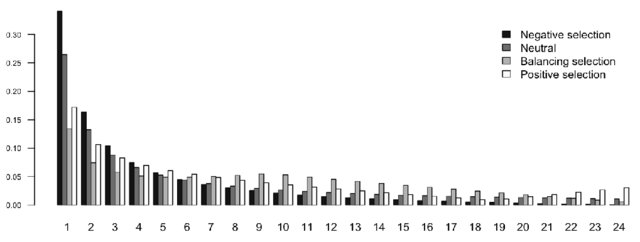

```{r setup, include=FALSE}
knitr::opts_chunk$set(echo = TRUE)
```


Para esta sección, seguiremos utilizando el ejemplo de los datos de peces

```{r packages, message=FALSE, warning=FALSE}
library(adegenet)
library(pegas)       
library(poppr)      
```

Continuando con nuestro objeto genind llamado `fish.ind`
```{r archivo genind}
fish.ind <- readRDS(file.path("../Seccion_II/outputs/", "fish.ind.rds"))
fish.ind
```

Primero obtendremos los counts por individuo:
```{r alelos}
allele_counts <- tab(fish.ind, freq = FALSE)  # rows = individuals, cols = alleles
```

Ahora mapearemos los alelos a los loci:
```{r map de alelos}
locus_factor <- locFac(fish.ind)
```

Minor allele count por locus
```{r minor allele}
minor_counts <- tapply(1:ncol(allele_counts), locus_factor, function(cols) {
  counts_per_allele <- colSums(allele_counts[, cols, drop = FALSE], na.rm = TRUE)
  min(counts_per_allele)
})
```

Removemos los loci monomórficos
```{r loci monomorficos}
minor_counts <- minor_counts[minor_counts > 0]
```


Count-based SFS
```{r count-based SFS}
sfs <- table(minor_counts)
```

Finalmente graficamos en un barplot nuestros resultados:
```{r plot}
barplot(sfs,
        xlab = "Minor allele count",
        ylab = "Number of loci",
        main = "Count-based Site Frequency Spectrum",
        col = "steelblue")
```


  El **SFS** (Site Frequency Spectrum) ofrece una visión general de la distribución de frecuencias de las variantes genéticas, lo que permite formular distintas hipótesis acerca de los procesos demográficos que ocurren en una población.{width=100%,height=100%}

