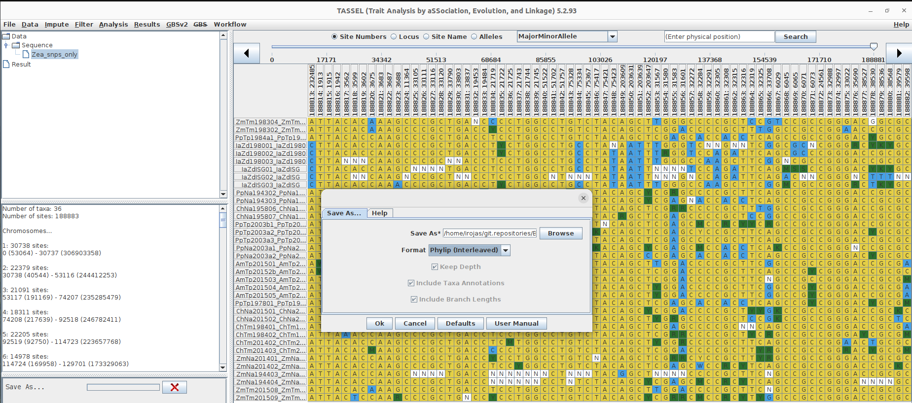
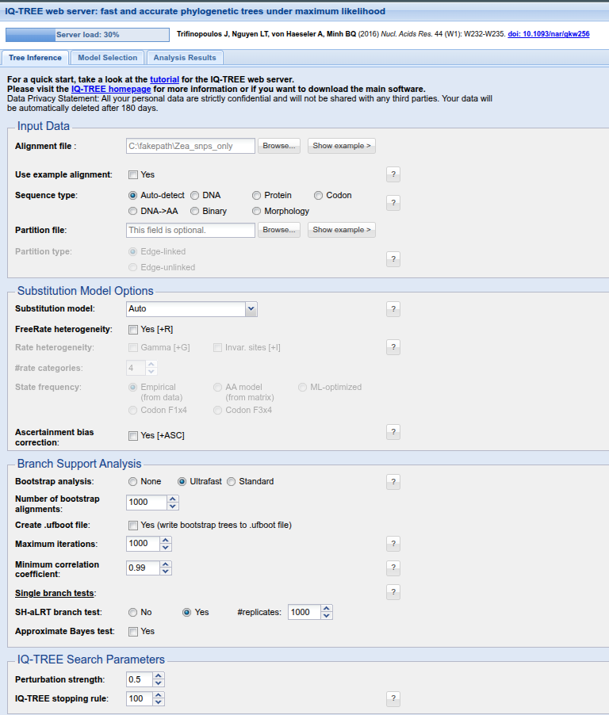

```{r setup, include=FALSE}
library(ggplot2)
library(ggtree)
library(ape)
library(wesanderson)

```
## 3.4 Construcción de la filogenia con SNPs
### 3.4.1 Conjunto de datos

Para construir la filogenia emplearemos individuos de la especie *Zea perennis* y de tres subespecies de *Zea mays*: *Zea mays* ssp. *mays*, *Zea mays* ssp. *mexicana* y *Zea mays* ssp. *parviglumis*. 

Realizaremos un **filtrado estricto** de los datos , considerando que provienen de un genotipado por **GBS**. Este filtrado nos permitirá conservar únicamente aquellos sitios variables con una proporción de datos faltantes igual o menor al **5%**, una calidad mínima de **30** y una profundidad mínima de **5X**.

El objetivo del filtrado  es **reducir considerablemente el número de SNPs**, pasando de **316,294** a **12,892 SNPs**, con el fin de optimizar el tiempo de cálculo durante la construcción de la filogenia.

Para ello emplearemos *vcftools* con el comando `system`.

```{r vcf_filter, echo=TRUE}

#system("vcftools --vcf ../../data/Zea_mays.AGPv4.2x_0.8_0.01.NewID.Rojas2019.recode.vcf --keep ./meta/subset_arbol.txt --remove-indels --max-missing 0.95  --minQ 30 --minDP 5 --recode --recode-INFO-all --out ./subset/Zea_snps_only")
```
## 3.4.2 Construcción de la filogenia con software externo

Convertiremos el subset de SNPs en un archivo Phylip interleaved, empleando el software [Tassel5](https://tassel.bitbucket.io/) que permite generar un archivo phyl a partir de un archivo *vcf*.



El archivo de salida obtenido puede emplearse para construir una filogenia utilizando software externos a **RStudio**. En este caso, proponemos dos opciones:

- [FastTree](https://morgannprice.github.io/fasttree/)
- [IQ-TREE](https://iqtree.github.io/)

El servidor web de **IQ-TREE** permite someter alineamientos que no superen los **8 MB**, aunque la memoria RAM está limitada a **1 GB** y el tiempo máximo de ejecución es de **24 horas**.  
Si el cálculo excede estos recursos, el análisis debe someterse nuevamente.


Una alternativa más rápida es **FastTree**; no obstante, el soporte estadístico que proporciona puede no ser suficiente para una publicación formal. Aun así, es un recurso valioso para realizar **análisis exploratorios**.  

En este ejercicio emplearemos el árbol producido por `FastTree`.

### 3.4.3 Visualización de filogenias

Cargaremos el archivo **Newick** en **RStudio** para su visualización.
```{r load.phyl, echo=TRUE}
zea_tree <- read.tree("./subset/Zea_snps_only" )    

```
Visualiza el arbol con ggtree
```{r ggtree, echo=TRUE}

ggtree(zea_tree) +   theme_tree2()
  
```
ggtree nos permite agregar diferentes capas y editar la filogenia. Con el comando `geom_nodepoint` podemos visualizar los nodos. 
```{r tree.s2}
  ggtree(zea_tree) +   theme_tree2()+
  geom_nodepoint()
```
Ahora agregaremos las etiquetad de las puntas del arbol. 
```{r add_labels}
ggtree(zea_tree) +   theme_tree2()+
  geom_nodepoint()+ geom_tiplab() 

```
En la filogenia representada, el clado de *Zea diplperennis*, es el grupo mas distante y lo emplearemos para enraizar el árbol. 
```{r root_tree, echo=TRUE}

clade_tips <- c("JaZdJSG03", "JaZdJSG02", "JaZd198002", 
                "JaZd198001", "JaZd198003", "JaZdJSG01")

# Root the tree at MRCA of selected tips
rooted_tree <- root(zea_tree, node = getMRCA(zea_tree, clade_tips))

# Plot and adjust margins
ggtree(rooted_tree) +
  geom_tiplab(align = TRUE, linesize = 0.5) +
  xlim_tree(0.35) +  # <---- increases right margin for labels
  ggtitle(expression("Tree rooted by "*italic("Zea diploperennis")*" clade")) +
  theme_tree2()
  
```

La nueva visualización nos permite observar lo que ya se ha descrito para los maíces domesticados: el grupo de *Zea mays* ssp. *parviglumis* (Zp), proveniente de la región del Balsas, es el ancestro descrito para los maíces modernos.  

Además de visualizar el árbol, podemos agregar diferentes capas al gráfico, como la delimitación de clados u otros elementos que faciliten la interpretación filogenética.


```{r MRCA}
# Define MRCA nodes correctly
zmays_mrca <- getMRCA(rooted_tree, c("ChNa201502", "ZmNa201401"))
zpar_ancestor <- getMRCA(rooted_tree, c("PpTp1984a1", "PpTp2003b1"))
zmex_mrca <- getMRCA(rooted_tree, c("AmTp201505", "ZmTm201509"))
zdip_mrca <- getMRCA(rooted_tree, c("JaZdJSG01", "JaZdJSG02"))

# Define clade colors
clade_colors <- c(
  zmays = "#849585",
  zpar  = "#BFB17C",
  zmex  = "#D88A3B",
  zdip  = "#854D65"
)

# Plot
ggtree(rooted_tree) +
  geom_tiplab(align = TRUE, linesize = 0.5) +
  xlim_tree(0.6) +

  geom_cladelabel(node = zmays_mrca, label = "Zea mays",
                  color = clade_colors["zmays"], 
                  offset = 0.1, align = TRUE, barsize = 1, fontsize = 3.5) +

  geom_cladelabel(node = zpar_ancestor, label = "Z. parviglumis",
                  color = clade_colors["zpar"], 
                  offset = 0.18, align = TRUE, barsize = 1, fontsize = 3.5) +

  geom_cladelabel(node = zmex_mrca, label = "Z. mexicana",
                  color = clade_colors["zmex"], 
                  offset = 0.2, align = TRUE, barsize = 1, fontsize = 3.5) +

  geom_cladelabel(node = zdip_mrca, label = "Z. diploperennis",
                  color = clade_colors["zdip"], 
                  offset = 0.2, align = TRUE, barsize = 1, fontsize = 3.5) +

  ggtitle(expression("Tree rooted by "*italic("Zea diploperennis")*" clade")) +
  theme_tree2()

```

Además de delimitar los clados, también podemos colorearlos con el comando `geom_hilight`

```{r highlight_clade, echo=FALSE}
# Define MRCA nodes correctly
zmays_mrca <- getMRCA(rooted_tree, c("ChNa201502", "ZmNa201401"))
zpar_ancestor <- getMRCA(rooted_tree, c("PpTp1984a1", "PpTp2003b1"))
zmex_mrca <- getMRCA(rooted_tree, c("AmTp201505", "ZmTm201509"))
zdip_mrca <- getMRCA(rooted_tree, c("JaZdJSG01", "JaZdJSG02"))

# Define clade colors
clade_colors <- c(
  zmays = "#849585",
  zpar  = "#BFB17C",
  zmex  = "#D88A3B",
  zdip  = "#854D65"
)

# Plot
ggtree(rooted_tree) +
  geom_tiplab(align = TRUE) +
  xlim_tree(0.35) +

  geom_hilight(node = zmays_mrca, fill = clade_colors["zmays"]) +

  geom_hilight(node = zpar_ancestor, fill = clade_colors["zpar"] ) +

  geom_hilight(node = zmex_mrca, fill = clade_colors["zmex"]) +

  geom_hilight(node = zdip_mrca, fill = clade_colors["zdip"]) +

  ggtitle(expression("Tree rooted by "*italic("Zea diploperennis")*" clade")) +
  theme_tree2()

```


